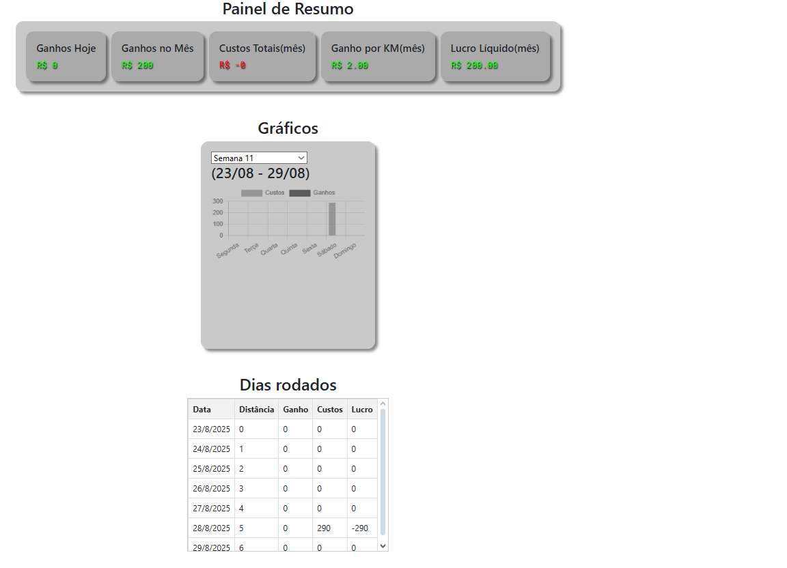

# Plataforma Financeira para Motoristas de Aplicativo

Uma aplicação web desenvolvida para ajudar motoristas de aplicativo a **controlarem seus ganhos, custos e lucros mensais**, de forma simples e visual. O sistema possui **painel de resumo, gráficos interativos e registros persistentes**, ideais para acompanhar o desempenho ao longo do tempo.

---

## Visão Geral

A plataforma possui duas abas principais:

### Aba de Registro

* Permite registrar **ganhos e custos** diários.
* Campos como **data, valor e quilometragem rodada**.
* Os registros são **armazenados no `localStorage`** (em versões futuras será usado um banco de dados real).

### Aba de Dashboard

* Mostra um **resumo mensal**: ganhos, custos, lucro líquido e ganho por quilômetro.
* Exibe um **gráfico interativo (Chart.js)** com ganhos e custos de cada dia da semana.
* Exibe uma **tabela detalhada** com os dias rodados e seus respectivos resultados.



---

## Funcionalidades

* [x] Registro de ganhos e custos diários
* [x] Cálculo automático de lucro líquido
* [x] Armazenamento local dos dados (localStorage)
* [x] Dashboard mensal com resumo financeiro
* [x] Gráficos de desempenho (Chart.js)
* [x] Tabela com histórico detalhado
* [ ] Conexão com banco de dados real
* [ ] Sistema de login e autenticação
* [ ] Exportação de relatórios (PDF/Excel)

---

## Tecnologias Utilizadas

| Tecnologia           | Descrição                                  |
| -------------------- | ------------------------------------------ |
| **HTML5**            | Estrutura da aplicação                     |
| **CSS3**             | Estilização e responsividade               |
| **JavaScript (ES6)** | Lógica, manipulação do DOM e armazenamento |
| **Chart.js**         | Criação de gráficos dinâmicos no dashboard |

---

## Como Executar o Projeto

1. **Clone o repositório:**

   ```bash
   git clone https://github.com/GuilhermeG08/UberCalculadora.git
   ```

2. **Acesse a pasta do projeto:**

   ```bash
   cd nome-do-repositorio
   ```

3. **Abra o arquivo principal no navegador:**

   * Abra `index.html` diretamente no navegador (duplo clique) ou use um servidor simples (ex: `npx serve` ou `Live Server` do VSCode).

---

## Exemplo de Uso

1. Acesse a aba **Registro** e adicione os ganhos e custos do dia.
2. Vá até o **Dashboard** e visualize seus lucros, custos e ganhos por semana/mês.
3. Acompanhe os gráficos e use as informações para ajustar sua rotina de trabalho.

---

## Futuro do Projeto(em andamento)
* Adição do back-end(nodeJS)
* Integração com banco de dados
* Autenticação segura
* Conexão com BOT de WhatsApp para permitir registros por mensagens de aúdio 

---

## Autor

**Guilherme Gomes**
💼 Estudante de Ciência da Computação 
🔗 [LinkedIn](https://www.linkedin.com/in/guilherme-gomes-fend) • [GitHub](https://github.com/GuilhermeG08)

---

## Licença

Este projeto é de uso livre para fins de estudo e portfólio. Sinta-se à vontade para contribuir ou adaptar.

---

## Créditos

* Desenvolvido por Guilherme Gomes
* Gráficos com Chart.js
